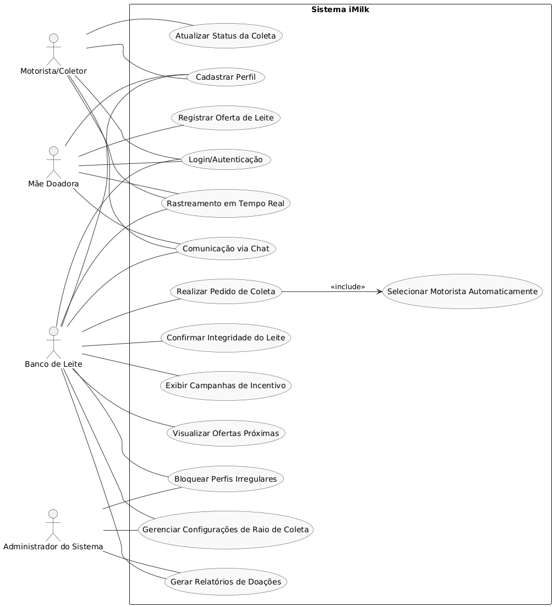
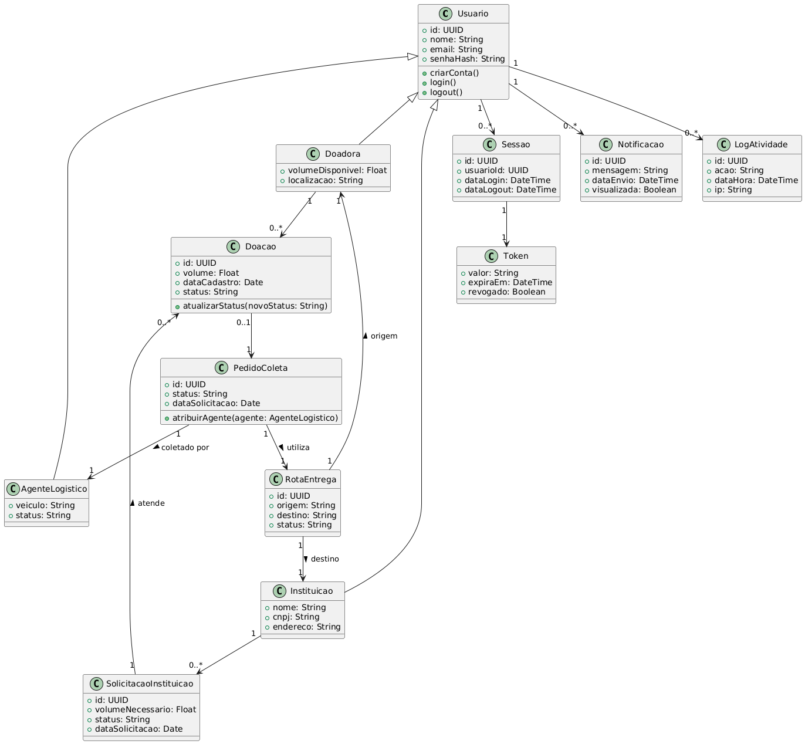

# 📊 Diagramas UML do Sistema

## Visão Geral do Sistema

> Diagrama com visão geral do sistema

## Casos de Uso

| Nome                                  | Descrição breve                    | 
| ------------------------------------- | ---------------------------------- | 
| [Realizar Cadastro](./UC_cadastro.md) | Cadastra novos usuários no sistema |
| [Oferecer Leite](./UC_DispColeta.md)  | Doadora informa coleta disponível  |
| [Solicitar Leite](./UC_SolColeta.md)  | Instituição solicita coleta        |                                  

## 🔹 Diagrama de Classes

## 🔹 Diagrama de Estados

> Mostra os estados possíveis de cada entidade e as transições entre eles.

| Nome                                | Finalidade / Obs               |
| ----------------------------------- | ----------------------------   |
| [Cadastro](./DE_cadastro.png)       | Status do processo de cadastro |
| [Doação de Leite](./DE_doacao.png)  | Status do processo de doação   |
| [Estados Críticos](./Diagramas_de_estado.png)  | Status do processo de doação   |

## 🔹 Diagrama de Atividades

| Nome                                          | Descrição breve                   |
| --------------------------------------------- | --------------------------------- |
| [Cadastro](./AT_cadastro.png)                 | Atividade de cadastro de usuário  |
| [Disponibilizar coleta](./AT_DispColeta.png)  | Processo de doação de leite       |
| [Solicitar Coleta](./AT_SolColeta.png)        | Processo de solicitação de coleta |

## Diagrama de Componentes 

| [Diagrama](./Diagrama-de-componentes.png) |

## Diagrama de Arquitetura

[Diagrama](./Diagrama-de-arquitetura.png)
